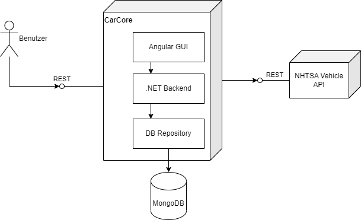

# Lösungsstrategie

## Technologieentscheidungen

### Backend: ASP.NET
Da das Team am meisten Erfahrung im .NET Ökosystem würde sich für diesen Stack entschieden. 
Außerdem ist das ASP.NET Framework speziell für die Entwicklung von Web APIs entwickelt worden und bringt deswegen alle notwendigen Funktionen mit sich.

### Frontend: Angular
Im Frontend wird eine Single-Page-Anwendung gebaut.
Daher schien Angular aufgrund der komponentenbasierten Entwicklung und dem dynamischen Nachladen als gute Wahl.
Angular ist ein sehr umfangreiches Framework (vielleicht zu umfangreich für dieses Projekt), aber mit ein wenig Erfahrung ist es schnell.

### Datenbank: MongoDB
Der Hauptgrund für die Verwendung der Document Database MongoDB ist, dass die externe API eine JSON-Datei zurückgibt.
Strukturierte Datenformate wie JSON können in MongoDB gut gespeichert werden.
Außerdem kann MongoDB mit dem Testcontainers-Projekt containerisiert werden, was das Schreiben von Integrationstests vereinfacht.
Zuletzt wird MongoDB durch ein NuGet Paket in .NET unterstützt, was das Schreiben der Anfragen vereinfacht.

## Top-Level-Zerlegung des Systems

**NHTSA Vehicle API**
Als externe API wird die Vehicle API von der US Behörde für Straßen und Fahrzeugsicherheit (NHTSA) eingebunden.
Über die API kann eine umfassende Liste von Fahrzeugmarken- und Modellen abgerufen werden.
Die API wurde ausgewählt, weil sie im Vergleich zu anderen Fahrzeugdaten-APIs kostenlos und frei verfügbar ist (kein API-Key notwendig). 
Dafür enthält die API jedoch keine Daten zu den Fahrzeugpreisen.

**3 Schichten Architektur**
    

 

## Entscheidungen zur Erreichung der wichtigsten Qualitätsanforderungen 

